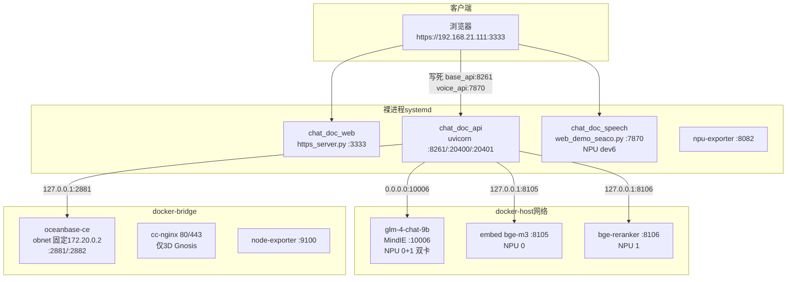
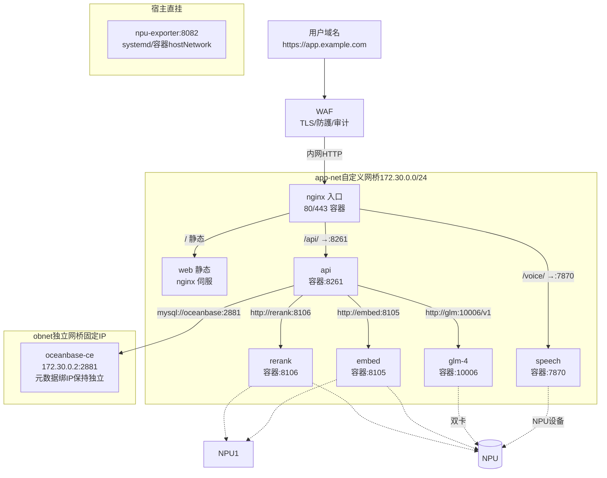
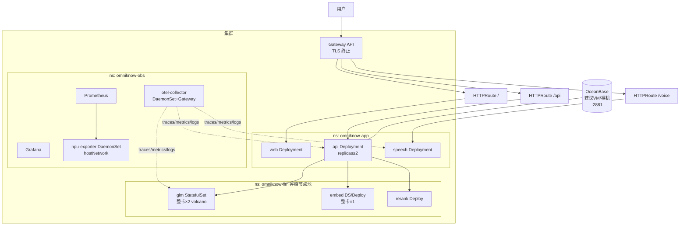
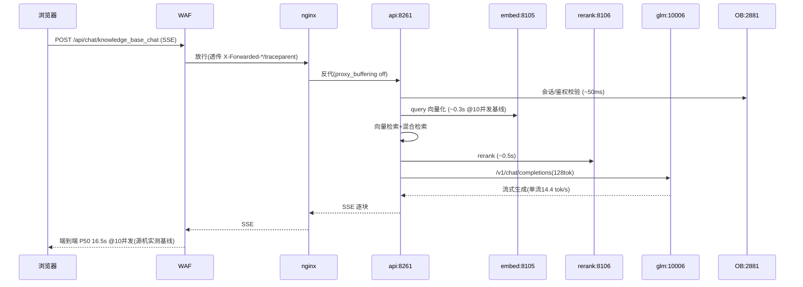

# 架构与网络链路图

> 图均为 Mermaid，可直接在支持 Mermaid 的查看器渲染。现状与端口均来自备份核实 ✅。

## 一、现状架构（源机 192.168.21.111，混合形态）

**问题**：① 前端写死宿主 IP；② 服务间靠 host 网络回环互通；③ 三类形态（裸进程/host容器/bridge容器）并存；④ 入口不统一。

## 二、目标形态 A：docker-compose 全容器 + nginx + WAF（一期）

要点：
- **服务名即地址**：api 里全部 `os.getenv("EMBED_URL","http://embed:8105/v1")` 风格，与 IP 彻底解耦。
- **OB 独立网桥**：沿用"固定容器 IP + 独立 network"方案（源机已验证：集群元数据绑定首启 IP，混网/换网段=重建）。
- **WAF 只见 nginx**：外部地址变更（换域名/换 IP）零配置影响。

## 三、目标形态 B：k8s + Gateway API（二期）

## 四、请求链路时序（RAG 问答，含实测延迟基线）

## 五、端口与地址总表（形态 A 目标约定）

| 服务 | 容器名/服务名 | 网内地址(示例) | 宿主映射 | 说明 |
|---|---|---|---|---|
| 入口 nginx | gateway | gateway:80 | 80/443 | 唯一对外 |
| web | web | web:80 | 不映射 | 静态 |
| api | api | api:8261 | 可选 8261(调试) | /api 前缀剥离 |
| speech | speech | speech:7870 | 不映射 | NPU |
| glm | glm | glm:10006 | 不映射 | NPU×2 |
| embed | embed | embed:8105 | 不映射 | NPU |
| rerank | rerank | rerank:8106 | 不映射 | NPU |
| oceanbase | oceanbase | 172.30.0.2(obnet) | 2881(可选) | 固定 IP |
| npu-exporter | npu-exporter | host | 8082 | 宿主直跑 |

> 端口冲突提示（⚠️ 待验证）：host 网络迁 bridge 后，api 的 8261/20400/20401 与 nginx 80/443 不再共享宿主栈，原"源机端口全景"可简化为对外仅 80/443（+可选调试端口）。

## 六、WAF 链路要点（内外地址不同场景）

1. 外部：`https://app.example.com`（WAF 证书）→ 内部：`http://gateway.nginx:80`（或内网 IP:端口）。
2. 必透传头：`X-Forwarded-For`、`X-Forwarded-Proto`、`X-Request-ID`；api 侧 uvicorn 启动加 `--proxy-headers --forwarded-allow-ips='<网关IP/网段>'`。
3. 流式：WAF 与 nginx 都不得缓冲 SSE（`proxy_buffering off`；WAF 关闭响应体扫描或对 `/api/chat/*` 白名单直传）。
4. 上传：文档上传（知识库）与音频上传（ASR）走 `client_max_body_size 200m` 起；WAF 体检限制同步放开。
5. 管理面：`/docs`、`/redoc`、`/metrics` 在 WAF/nginx 层一律封禁外网。
