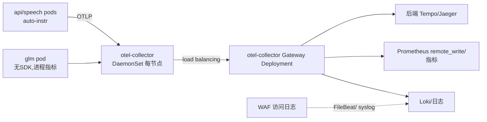

# SRE 补充建议（可观测性 / 安全 / 容量 / k8s 专项）

> 站在交付后长期运维视角，基于本项目已实证的事件（OOM、加载风暴、OB IP 绑定、npu-exporter DCMI 限制）与压测基线给出。

## 一、可观测性：otel 纳入计划（k8s 必做，compose 形态轻量版可选）

### 1.1 三支柱设计

| 支柱 | compose 形态（一期） | k8s 形态（二期） |
|---|---|---|
| **Traces** | api 容器注入 `opentelemetry-instrument`（uvicorn+requests+pymysql 自动埋点）→ 本机 otel-collector →Tempo/Jaeger | 同左 auto-instrumentation（Operator 注入 sidecar）+ Gateway 层 Collector |
| **Metrics** | Prometheus 抓 node/npu/服务指标 + Grafana | Prometheus Operator（ServiceMonitor）+ kube-state-metrics |
| **Logs** | docker logging driver json-file + Loki promtail | Vector/Fluent-bit DaemonSet → Loki |

### 1.2 otel-collector 部署形态（k8s）

要点：
- **trace 贯穿链路**：nginx 注入/透传 `traceparent`（WAF→nginx→uvicorn→requests→GLM HTTP 调用全程传播），一次 RAG 请求可看到 embed/rerank/glm 各段耗时（替代源机"日志里猜 16.5s 花在哪"的窘境）。
- **LLM span 语义**：对 GLM 调用加 span 属性（model=glm-4, prompt_tokens, completion_tokens），Grafana 直接出"每请求 token 用量/生成速率"。
- **无 SDK 的模型容器**：MindIE/TEI 无法埋点，用 metrics 补（npu-exporter 显存/AICore + api 侧调用维度指标）。

### 1.3 指标与告警清单（阈值取自本项目实证）

| 告警 | 阈值（起点） | 依据 |
|---|---|---|
| NPU 显存饱和 | mindie 进程显存 > 总量 95% 持续 5m | 源机 OOM 实证（maxBatchSize 200 时 44.2G 全满） |
| NPU 显存越界趋势 | 峰值环比 +10%/天 | KV 池参数变更回归信号 |
| RAG P95 延迟 | > 30s 持续 10m | 基线 P50 16.5s / max 27.5s @10 并发 |
| GLM 服务 5xx/超时 | >1% 5m | 压测 0 失败基线 |
| 模型就绪时长 | 启动→ready > 10m | 基线 35s~2min（MindIE 32K 档实测 35s） |
| OB 连接失败 | 任意 2 次 | 源机曾因 IP 抢占断连 |
| 磁盘（OB/向量库卷） | >80% | /deploy 曾 25%，增量=文档+向量 |
| 证书过期 | <30d | WAF/nginx TLS |

### 1.4 npu-exporter（昇腾特有，已踩坑）
- 容器内 DCMI 枚举不到卡（15+ 组合验证失败，README 有记录）→ **一期保持宿主 systemd 直跑 :8082**；k8s 用 `hostNetwork: true` + `hostPath /usr/local/Ascend/driver` DaemonSet。
- 采集项：`npu_chip_memory_used/total`、health 状态（health != OK 告警）。

## 二、安全加固清单

| 项 | 动作 |
|---|---|
| 密钥管理 | JWT secret、DB 密码、模型 api key（cc）从代码/明文迁到 `.env`(compose secrets) / Secret(k8s) |
| 管理面收敛 | `/docs`、`/redoc`、`/openapi.json`、`/metrics` 在 WAF/nginx 封禁外网；Bearer cc 换成强随机 |
| TLS | 前端自签证书全部下线，统一 WAF/网关证书；内部明文 HTTP（网桥内） |
| 上传防护 | 白名单后缀（pdf/docx/pptx/md/txt/mp3/mp4）、大小上限、病毒扫描挂 WAF |
| 认证 | 登录接口限速（防 b64 字典）；JWT 过期从 7 天收短至 1~2 天 |
| 审计 | WAF 访问日志 + api 审计表（登录/删除类操作） |

## 三、容量基线（源机实测，作为资源规划的锚点）

| 指标 | 实测值 | 用途 |
|---|---|---|
| GLM 吞吐峰值 | 173 tok/s @16 并发 | 单实例服务能力上限 |
| GLM 直连延迟 | P50 1.55~2.43s（c=10~32） | SLO 参照 |
| RAG 全链路 | P50 16.5s / max 27.5s @10 并发；c=16 时 P50 24.8s | 业务 SLO；超 16 并发需排队/扩实例 |
| GLM 容器内存 | 24.0 GiB（RSS） | 容器 memory 预留 |
| NPU 显存 | 30.9G/卡（权重9G+KV16G+32K rope 2G+固定） | k8s 整卡调度依据 |
| embed/rerank | 4.6G / 3.3G 内存，1.3~1.7G NPU 显存 | 同上 |
| api 进程 | 321 MiB | 轻 |
| speech | 6.1G 内存 + 4.8G NPU | 不用语音可整体裁撤 |
| OB | 1.4G 内存 33% CPU（mini） | 单副本上限注意 |

**结论**：单机（8核/62G/双卡）合理上限 = **10 路并发 RAG 稳定、16 路可用**；超出需横向加 LLM 实例（每实例独占一双卡节点）+ 前置排队。

## 四、k8s 专项（二期落地要点）

1. **昇腾调度**：部署 Ascend Device Plugin + volcano；GLM 需 `ascend.kp910` 整卡×2（`resources: huawei.com/Ascend910: 2` 类似声明按 310P 实际型号），embed/rerank/speech 各 1 卡；节点打标 `npu=true` 专用节点池。
2. **模型=有状态**：glm 用 StatefulSet + PVC（模型权重 conf/），镜像不含权重（权重走 PVC/对象存储预热），避免 18G 镜像。
3. **探针**：GLM readiness=`GET /v1/models`(200)（首启 35s~2min，failureThreshold 放宽）；api readiness=登录探针；startupProbe 给模型容器 10m 预算。
4. **OB 决策**（关键风险）：集群元数据绑定首启 IP → Pod 重建换 IP=集群失联。方案优先级：**a) DB 留在 VM/裸机（推荐）**；b) 单实例 StatefulSet + 固定 PodDNS 配置 + 严禁重建策略；c) 换 MySQL/PG 云原生库（业务是 MySQL 协议，改动小）。
5. **错峰与预算**：`priorityClassName`（DB>api>模型），模型 Pod 加 initContainer sleep 错峰；PDB 保 api 最小可用 1。
6. **Gateway API**：HTTPRoute 三条（`/`、`/api`、`/voice`）+ BackendTLSPolicy 可后置；超时对齐 RAG（`timeouts: request: 300s`）。
7. **配置**：`.env` → ConfigMap（非密）+ Secret（密钥）；热更仅限非模型参数。
8. **多平台**：昇腾栈仅 arm64 → 节点池按 arch 隔离；通用镜像（api/web/nginx）做 multi-arch（buildx arm64+amd64）。

## 五、交付运维流程补充

- **镜像仓**：私有 Harbor（arm64 推送 `linux/arm64` tag；离线环境用 `docker save/load` 清单化）。
- **配置渲染**：`.env` 模板 + `envsubst` 生成各环境实际值；禁止"手改线上文件"（源机 config 漂移教训：compose 挂载被注释导致 OB 反复起不来）。
- **变更三步**：备份→改→冒烟（登录/RAG/上传三接口）；每次变更记录到 README 版本历史。
- **回归压测**：perf_test1/2/3 脚本随交付包，验收必跑（10 并发 0 失败为门槛）。
- **备份**：OB 业务库每日 mysqldump + knowledge_base/ 向量目录 rsync；模型权重只备配置不备权重。
